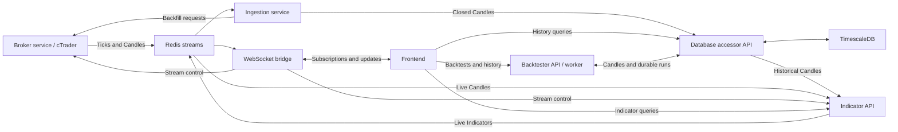

# AlgoTrader

AlgoTrader is an experimental trading project that uses the [Lightweight Charts](https://tradingview.github.io/lightweight-charts/) library to visualize historical market data.

## Documentation Ownership

- Human-facing overview and setup live in this README and area README files.
- Agent-facing vocabulary, system flow, and cross-service contracts live in
  [CONTEXT.md](CONTEXT.md) and its focused references.
- Task-specific context routing lives in [the context map](docs/CONTEXT-MAP.md).
- Durable architecture decisions live in `docs/adr/`.

## Architecture



Shared Python libraries provide data access, indicator computation, and logging.
For ownership and transport contracts, see [root context](CONTEXT.md).

## Development Disclaimer

This project is in active development and may undergo significant changes. **Backward compatibility is not guaranteed**—things might break! Please use this repository **for reference only** and not as a stable library.

## Trading Risk Disclaimer

Trading in derivative instruments—including futures, options, CFDs, Forex, and
certificates—carries significant risk and may not be appropriate for all
investors. There is a possibility of losing the entire initial investment or even more. **Use this project at your own risk.**

## Support the Project

If AlgoTrader has helped you with your algorithmic trading journey, you can support its continued development by using my [IC Trading affiliate link](https://www.ictrading.com?camp=86158) when opening a trading account. IC Trading offers competitive spreads and reliable execution for algorithmic traders.

*Using this link costs you nothing extra but helps fund the development of new features and improvements.*

## Prerequisites

- [Docker](https://docs.docker.com/get-started/get-docker/) with the Compose v2 plugin (`docker compose`).
- GNU Make (`make`).
- Python 3 (`python3`) and PyYAML for host-side config generation.

On Debian/Ubuntu, install the host setup tools (install Docker separately using the link above):

```sh
sudo apt update
sudo apt install make python3 python3-yaml
```

## Getting Started

1. Clone the repository:
   ```sh
   git clone https://github.com/s-stolz/algotrader.git
   cd algotrader
   ```
2. Create local secrets from the example:
   ```sh
   cp config/.env.secrets.example config/.env.secrets.local
   ```
3. Edit `config/topology.yaml` for shared non-secret settings (ports, hosts, tuning), and edit `config/.env.secrets.local` for credentials/secrets.
   For machine-specific non-secret values, copy `config/topology.local.example.yaml`
   to `config/topology.local.yaml` and edit only the overrides you need. This file is
   ignored by Git. Ingestion history defaults to 90 days; choose `lookback_days` or
   a quoted `start_date`, setting the other to `null`.
4. Generate runtime env files from shared topology + local overrides + local secrets:
   ```sh
   make config
   ```
5. Run the project and explore.

## Running with Docker Compose

Default workflow (auto-regenerates config env files before Compose):
   ```sh
   make up
   ```

Direct Docker Compose usage:
   ```sh
   python3 scripts/generate_env.py --force
   docker compose --env-file config/.env.shared up --build
   ```
This will build and start all necessary services as defined in the `docker-compose.yml` file.

### Asynchronous backtests

Compose starts two processes from the same backtester image:

- `backtester-api` exposes the public API on `http://localhost:8020` by default
  and provides `GET /health`.
- `backtester-worker` is a singleton worker that claims and executes one durable
  run at a time.

The API port, logging settings, and worker poll interval come from
`services.backtester` in `config/topology.yaml`. The tracked worker default is
one second. After the stack
is healthy, run the fixture-backed success and failure smoke paths:

```sh
make smoke-backtester
```

The smoke command seeds a temporary market and candles through
`database-accessor-api`, submits through the public backtester API, waits for
terminal status, verifies metrics/fills/trades for the successful run, verifies
no partial artifacts for the failed run, and cleans up its terminal runs.

## Central Configuration Model

- Tracked shared topology: `config/topology.yaml`
- Gitignored secrets: `config/.env.secrets.local`
- Generated runtime env files: `config/.env.shared`, `config/.env.secrets.db`, `config/.env.secrets.runtime`, `config/.env.secrets.broker`
- Generator script: `scripts/generate_env.py`

Topology groups all settings by their owner under `services` or `infrastructure`.
Each component has `network`, `logging`, `resources`, and runtime tuning groups
where applicable. Backtester groups its `api` and `worker` beneath
`services.backtester`; shared logging and sweep settings live alongside them.
Webserver, broker, and ingestion tuning live inside their service entries.
See [the topology schema](config/topology.schema.md) for the complete structure.

### Validation and overwrite

```sh
python3 scripts/generate_env.py --validate
python3 scripts/generate_env.py --force
```

### Make targets

```sh
make config
make validate-config
make smoke-backtester
make up
make build
make down
make restart
make logs
make ps
```

### Docker resource budgets

Edit `cpus` and `memory_reservation_mb` in each container's `resources` mapping
in `config/topology.yaml`. For example, the worker budget lives at
`services.backtester.worker.resources`, and Redis's budget at
`infrastructure.redis.resources`.
`make config` generates the variables consumed
by `docker-compose.yml`; do not edit generated env files. CPU quotas throttle
execution. Memory reservations are soft and allow containers to exceed the
configured amount; they do not allocate RAM in advance. Hard memory caps are
intentionally omitted because exceeding one can trigger an out-of-memory kill.
Exhausting the Docker VM's memory can still kill processes.

For a 16 GB Mac with 10 logical CPUs, start with **4 CPUs, 6 GB RAM, and 1 GB
swap** in **Docker Desktop → Settings → Resources → Advanced**. This separate
machine setting governs the whole Docker VM, including other projects and builds;
the per-container quotas share that budget. Applying Desktop settings restarts
Docker. Tune these starting values against `docker stats` during representative
backtests and chart use, alongside macOS Activity Monitor's memory pressure.

Apply container configuration between backtests because recreation interrupts
active work:

```sh
make config
docker compose --env-file config/.env.shared config --quiet
make up-detached
```

## Local Python Environments

Use a root virtual environment for shared library/test tooling and per-service virtual environments for service runtime dependencies.

### Shared constraints + service requirements

- Shared versions live in `constraints-shared.txt`.
- Each service keeps its own `requirements.txt`.
- If a service must diverge, add `<service>/constraints.override.txt` with a short rationale comment.

### Bootstrap all service venvs

```sh
make venvs
```

Equivalent direct command:

```sh
./scripts/setup_venvs.sh all
```

This now creates:
- root environment: `.venv` using `requirements.root.txt`
- service environments: `<service>/.venv` using each service `requirements.txt`

### Bootstrap only root venv

```sh
make venv-root
```

### Setup one service

```sh
make venv SERVICE=broker-service
```

### Recreate all service venvs

```sh
make venvs-recreate
```

### Validate existing environments

```sh
make venvs-check
```

## VS Code Multi-Venv Workflow

1. Open `algotrader.code-workspace` in VS Code (not only the repo root folder).
2. The workspace uses `python.defaultInterpreterPath = ${workspaceFolder}/.venv/bin/python`, so each service folder resolves to its own `.venv`.
3. If a service interpreter is not picked up immediately, run `Python: Select Interpreter` once while a file from that service is active.

## License

This project is licensed under the MIT License - see the [LICENSE](LICENSE) file for details.

This project makes use of third-party software so please check the [ATTRIBUTIONS.md](ATTRIBUTIONS.md) file for more information.
